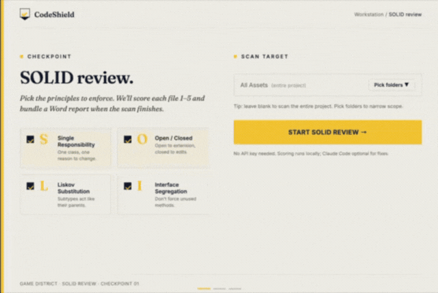
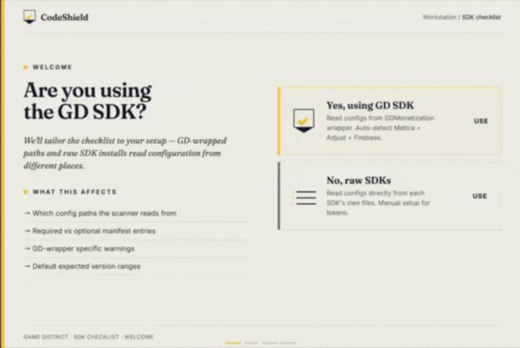

# ⚡ GD CodeShield

**One package. Two tools. Ship cleaner games.**

GD CodeShield is Game District's internal Unity editor toolkit that catches code quality issues and SDK misconfigurations before they reach production. Open it from `Tools → GD CodeShield` and pick your tool from the hub launcher.

---

## Demo

### SOLID Review
> Setup → Folder Selection → Scanning → Results with Scores & Violations → Word Export & AI Fix



### GD Checklist
> Hub → SDK Selection → 9-Tab Scan (AppLovin, Metica, Adjust, Firebase, Ad Units, Pre-Release, Build, Manual)



---

## Install via UPM (Git URL)

In Unity: `Window → Package Manager → + → Add package from git URL`

```
https://github.com/CoreTeamOrganization/GD-CodeShield.git
```

**Requirements:**
- Unity 2021.3 or newer
- `com.unity.nuget.newtonsoft-json` 3.0.2 (auto-installed as dependency)
- Claude API key for AI fix generation in SOLID Review (optional — scanning is always free)

---

## Open

```
Tools → GD CodeShield
```

The hub launcher opens. Click either card to open the tool.

---

## Tool 1 — SOLID Review

> *Scans your C# scripts for SOLID principle violations and generates AI-powered fixes.*

### What it checks

SOLID Review analyses every `.cs` file under your Assets folder (or a subfolder you choose) against four SOLID principles:

| Principle | What it catches |
|---|---|
| **SRP** — Single Responsibility | Classes doing too many unrelated things — God classes, bloated managers |
| **OCP** — Open/Closed | `switch`/`if-else` chains that need touching every time you add a feature |
| **LSP** — Liskov Substitution | Subclasses that break the contract of their base class |
| **ISP** — Interface Segregation | Fat interfaces forcing classes to implement methods they don't need |

> DIP (Dependency Inversion) is intentionally excluded — tight coupling is acceptable in casual mobile games.

Each file gets a score of **1–5 per principle** based on the GD Easy Rating Guide. The sidebar lists all files ranked by total violations so you know where to focus first.

### How to use

1. Open `Tools → GD CodeShield` → click **SOLID REVIEW**
2. Optionally pick a subfolder to limit the scan scope (default: all Assets)
3. Click **START SOLID REVIEW** — scanning is free, no API key needed
4. Click any file in the sidebar to see its violations in the detail panel

### Results view

- **Sidebar** — all scanned files with per-file violation count and colour-coded severity
- **Detail panel** — exact line number, which rule is broken, and why
- **Principle badges** — SRP · OCP · LSP · ISP pills in the top bar

### AI Fix Generation

Each violation has a **🚀 Run in Tool** button that opens Claude Code CLI with a pre-built prompt:

1. Copy the prompt or run it directly in Claude Code CLI
2. Claude proposes a refactored version with explanation
3. You review before applying anything

> AI suggestions may contain errors — always review before applying. Billed to your Anthropic account.

### Reports — Word (.docx) & HTML (.html)

Both export modes are available from the results sidebar and the in-editor **Preview report** window:

- **Project Report** — full summary across all scanned files: scores, principle ratings, and violation breakdown
- **File Report** — per-file detail matching the GD SOLID Review format: Scores at a Glance, per-principle breakdown, What to Fix, and priority list — ready to share directly with a developer

**Word (.docx)** requires the Node.js *runtime* installed on the machine. The `docx` package is bundled inside the tool — no `npm install` needed.

**HTML (.html)** is generated entirely in C# — no Node.js, Word, or npm required. A self-contained, styled page that opens in any browser; use this when Word isn't available (and "Print → Save as PDF" from the browser for a PDF).

### Settings

- API key stored in `EditorPrefs` — never committed to source control
- Scan root persists between sessions
- SDK files auto-excluded from scanning (Adjust, AppMetrica, MaxSdk, Firebase, etc.)

---

## Tool 2 — GD Checklist

> *Full release checklist — SDK keys, Player Settings, Build config, and manual device verification. Single scan, everything in one place.*

### What it checks

GD Checklist runs two types of checks in a single scan:

**Auto-checked** — reads your project files and settings directly, no manual work:

| Tab | What it validates |
|---|---|
| **AppLovin / AdMob** | SDK key, AdMob App IDs (Android + iOS) |
| **Metica** | API keys and App IDs (Android + iOS) |
| **Adjust** | App tokens, environment (must be Production for release), log level |
| **AppMetrica** | API keys, crash reporting, session tracking, log settings |
| **Firebase** | `google-services.json` + `GoogleService-Info.plist` present, network settings |
| **Ad Units** | All ad unit IDs per network (Interstitial, Rewarded, Banner, MRec, AppOpen) |
| **Pre-Release** | App version, bundle code, Graphics API = OpenGLES3, Require ES3.1 unchecked, Unity Services connected, Firebase files present, Adjust environment = Production, AppLovin Max Terms + Ad Review unchecked, AppMetrica auto-collection off |
| **Build** | Create symbols.zip = Public, Compression = LZ4HC |
| **Manual** | 20 device verification items — Debugging, Dashboards, Post-Release |

Each field shows:
- ✅ **Pass** — correct value confirmed
- ❌ **Fail** — wrong value, with exact fix instruction
- ⚠️ **Warn** — value set but needs attention
- ☐ **Manual** — requires device verification, click **✓ Confirm** after checking

### How to use

1. Open `Tools → GD CodeShield` → click **SDK CHECKLIST**
2. Answer the setup question and select your SDKs (once only)
3. Click **SCAN PROJECT**
4. Work through each tab — fix auto-detected issues, confirm manual items on device

### First-time setup

On first open, the tool asks: **are you using the GD SDK?**

Both paths go to the same SDK selection screen — the difference is how it pre-fills:

**GD SDK project** (`Assets/Configurations/SDKConfiguration.asset` present):
- SDKs are auto-detected from your project and pre-ticked
- You can uncheck any SDK before confirming
- Falls back to broad project-wide search if asset isn't at the expected GD path

**External / non-GD project:**
- All SDKs unchecked by default — tick only what your project uses
- Only selected SDKs are scanned — no false positives

You can always return to this screen via **⚙ Change Setup** in the top bar. The setup screen also has a **← Back** button to return to the previous screen.

### Ad Units tab — respects your selection

The Ad Units tab only scans networks you selected during setup. If you unchecked Metica, no Metica ad unit rows appear. If you unchecked AppLovin, AppLovin and AdMob ad unit rows are skipped.

### Manual tab

20 items that can only be verified on a real device, grouped by category:

| Category | Items |
|---|---|
| **Monetization** | Firebase remote config updated, test + real ads verified, AppOpen from 2nd launch only, IAP working, consent + privacy policy current |
| **Debugging** | Adjust production + sandbox verified, internet panel shows correctly |
| **Permissions** | APK permissions checked via analyzer tool |
| **Dashboards** | Adjust testing console, Firebase DebugView, AppMetrica events |
| **Submission** | Symbol files provided with build |
| **Post-Release** | AppMetrica users + revenue normal, Firebase revenue + installs normal, Adjust installs + revenue normal, Play Console Android vitals, AppLovin ad units active + view rate consistent |

Each item has a **✓ Confirm** button — tap it after verifying on device. Confirmed items turn green. Use **↺ Undo** to unconfirm if needed.

### Rescan and reset

- **↺ Rescan** — reruns the full scan without leaving the results view
- **⚙ Change Setup** — resets SDK selection if your project's stack changes


## 🚀 Coming Soon — PR Enforcement via GitHub Actions

GD CodeShield moves from the editor to the pipeline. Every Pull Request will automatically trigger SOLID Review and SDK Checklist scans:

- **GitHub Check annotations** — violations posted inline with exact file and line number
- **Merge blocking** — PRs with SOLID score below threshold or SDK misconfigurations cannot be merged
- **Team notifications** — automatic email report(Code health) to the Team Lead 
- **No more self-reported compliance** — the tool decides, not the developer

> Code quality enforced before it hits main. Fix the code, then merge.

